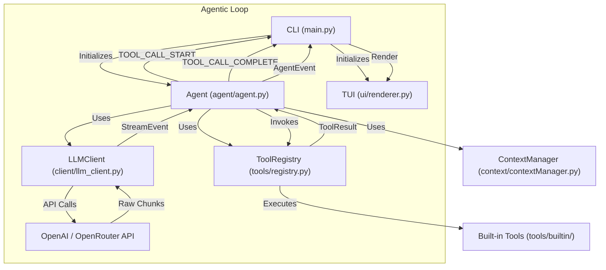

# Architecture Overview

Codentis is built on a clean, event-driven, multi-layered architecture designed for extensibility and robustness. The core principle is separation of concerns between the user interface, the agentic logic, tool execution, and low-level LLM communication.



## Core Components

### 1. Client Layer (`client/`)
Handles all external communication with Large Language Models.

- **`LLMClient`** (`llm_client.py`): A wrapper around the `AsyncOpenAI` client. Handles:
  - Authentication via `.env`.
  - Rate limiting with automatic retries and exponential backoff.
  - Response streaming — yields typed `StreamEvent` objects.
  - Tool call accumulation from streamed chunks.
- **`response.py`**: Defines data structures for LLM responses:
  - `StreamEvent` / `StreamEventType` — raw chunk types: `TEXT_DELTA`, `TOOL_CALL_COMPLETE`, `MESSAGE_COMPLETE`, `ERROR`.
  - `TokenUsage` — token consumption stats.
  - `ToolCall` — a completed tool call parsed from a streamed response.
  - `ToolResultMessage` — wraps tool output for re-injection into context.

---

### 2. Agent Layer (`agent/`)
Contains the core agentic loop and event orchestration.

- **`Agent`** (`agent.py`): Manages conversation state and the agentic loop.
  - Initializes `LLMClient`, `ContextManager`, and `ToolRegistry`.
  - Implements `async with` context manager for graceful client cleanup.
  - `run()` — top-level entry point; emits `AGENT_START` → loop events → `AGENT_END`.
  - `agentic_loop()` — streams LLM response, accumulates tool calls, dispatches them sequentially, and feeds results back into context.
- **`events.py`**: Defines high-level agent events emitted to the CLI:

| Event | Payload |
|---|---|
| `AGENT_START` | `message` |
| `AGENT_END` | `response`, `usage` |
| `AGENT_ERROR` | `error`, `details` |
| `TEXT_DELTA` | `content` (streaming chunk) |
| `TEXT_COMPLETE` | `content` (full text) |
| `TOOL_CALL_START` | `call_id`, `name`, `arguments` |
| `TOOL_CALL_COMPLETE` | `call_id`, `name`, `success`, `output`, `error`, `metadata`, `truncated` |

---

### 3. Tool System (`tools/`)
A pluggable tool execution layer with validation, kind-based categorisation, and schema export.

- **`base.py`**: Core abstractions:
  - `ToolKind` — enum: `READ`, `WRITE`, `SHELL`, `NETWORK`, `MEMORY`, `MCP`.
  - `ToolInvocation` — carries `params` and `cwd` for an execution request.
  - `ToolResult` — carries `success`, `output`, `error`, `metadata`, `truncated`. Has factory methods `success_result()` and `error_result()`, plus `to_model_output()` for serialisation back to the LLM.
  - `ToolConfirmation` — used for mutating tools that may require user approval.
  - `Tool` (abstract base) — all tools inherit from this. Provides `validate_params()`, `is_mutating()`, `get_confirmation()`, and `to_openai_schema()`.

- **`registry.py`**: `ToolRegistry` — a runtime registry of `Tool` instances.
  - `register()` / `unregister()` — dynamic tool management.
  - `get_schemas()` — exports all tool schemas in OpenAI function-calling format.
  - `invoke()` — validates params, runs `tool.execute()`, handles exceptions, returns `ToolResult`.
  - `create_default_registry()` — factory that auto-registers all built-in tools.

- **`builtin/`**: Built-in tool implementations.
  - **`read_file.py`** (`ReadFileTool`): Reads text files with line numbers, optional offset/limit pagination, token-budget truncation, and binary-file detection. Returns structured metadata (`path`, `total_lines`, `shown_start`, `shown_end`).

---

### 4. Context Layer (`context/`)
Manages the conversation history passed to the LLM.

- **`ContextManager`** (`contextManager.py`):
  - Maintains an ordered list of `MessageItem` objects.
  - Prepends the system prompt on every call to `get_messages()`.
  - Tracks token counts per message.
  - Methods: `add_user_message()`, `add_assistant_message()`, `add_tool_result()`, `get_messages()`.
- **`MessageItem`**: Dataclass representing a single conversation turn. Serialises to OpenAI message dict format, supporting `role`, `content`, `tool_call_id`, and `tool_calls`.

---

### 5. UI Layer (`ui/`)
Terminal rendering using `rich`.

- **`TUI`** (`renderer.py`): Handles all terminal output.
  - `begin_assistant()` / `end_assistant()` — framed streaming output.
  - `stream_assistant_delta()` — live text streaming.
  - `tool_call_start()` — renders a running panel with tool name, call ID, and arguments.
  - `tool_call_complete()` — renders a success/failure panel. For `read_file`, parses the line-numbered output and renders it as a `Syntax`-highlighted code block (theme: `monokai`) with a relative-path header.
  - `guess_language()` — maps file extensions to `rich`/Pygments language identifiers.
  - `extract_read_file_code()` — parses `read_file` output into `(start_line, code)` for syntax display.
- **Theme**: Custom `AGENT_THEME` with roles for `info`, `warning`, `error`, `tool.*`, `code`, etc.

---

### 6. Config Layer (`config/`)
- **`Config`**: Loads configuration (model name, API keys, etc.) from environment and `.env` via `python-dotenv`.

---

### 7. Utilities (`utils/`)
- **`paths.py`**: `resolve_path()` (resolves relative paths against a base), `is_binary_file()`, `display_path_relative_to_cwd()`.
- **`text.py`**: Token counting (`count_tokens`, `estimate_tokens`) and text truncation (`truncate_text`, `truncate_by_lines`, `truncate_by_characters`).

---

## Tool Lifecycle

```
Agent.agentic_loop()
  │
  ├─ LLM streams TOOL_CALL_COMPLETE events
  │    └─ Tool calls accumulated in list
  │
  ├─ For each tool_call:
  │    ├─ emit TOOL_CALL_START  →  TUI renders "running..." panel
  │    ├─ ToolRegistry.invoke()
  │    │    ├─ validate_params()
  │    │    └─ tool.execute(ToolInvocation)  →  ToolResult
  │    └─ emit TOOL_CALL_COMPLETE  →  TUI renders result panel
  │
  └─ All ToolResults added back to ContextManager as "tool" role messages
```

---

## Event Flow Summary

```
User Input
  → CLI.run_single()
    → Agent.run()
      → ContextManager.add_user_message()
      → Agent.agentic_loop()
        → LLMClient.chat_completion()  [streaming]
          → TEXT_DELTA events  →  TUI.stream_assistant_delta()
          → TOOL_CALL_COMPLETE events  →  accumulated
        → For each tool call:
          → TOOL_CALL_START  →  TUI.tool_call_start()
          → ToolRegistry.invoke()  →  ToolResult
          → TOOL_CALL_COMPLETE  →  TUI.tool_call_complete()
          → ContextManager.add_tool_result()
      → AGENT_END
```

---

## Future Extensions

- **Multi-turn agentic loop**: Re-run `agentic_loop` after tool results if the LLM wants to call more tools.
- **Additional built-in tools**: `write_file`, `search_file`, `execute_shell`, web search, etc.
- **Tool confirmation**: `ToolConfirmation` infrastructure exists for prompting the user before mutating operations.
- **Memory**: A `Memory` component can be injected into `ContextManager` for long-term context.
- **MCP tools**: `ToolKind.MCP` is already reserved for Model Context Protocol tool integration.
- **Multi-Agent**: The `CLI` can orchestrate multiple `Agent` instances for complex workflows.
