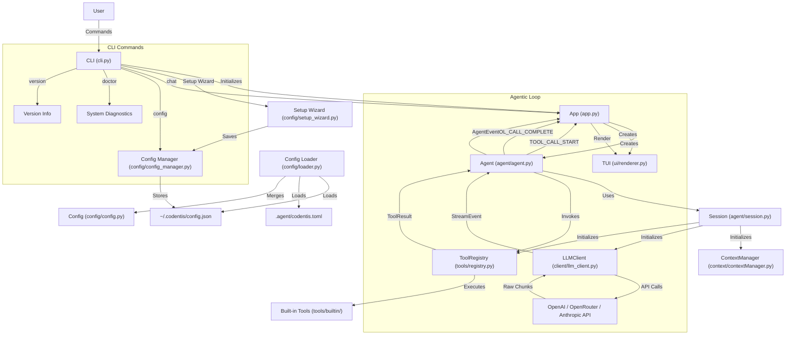

# Architecture Overview

Codentis is built on a clean, event-driven, multi-layered architecture designed for extensibility and robustness. The core principle is separation of concerns between the user interface, the agentic logic, tool execution, and low-level LLM communication.

## Package Structure

```
codentis/                      # Main package
├── __init__.py               # Package metadata and version
├── cli.py                    # CLI interface (Typer-based)
├── app.py                    # Core application logic
├── agent/                    # Agent orchestration
│   ├── agent.py             # Main agent loop
│   ├── session.py           # Session management
│   └── events.py            # Event definitions
├── client/                   # LLM communication
│   ├── llm_client.py        # OpenAI client wrapper
│   └── response.py          # Response data structures
├── config/                   # Configuration management
│   ├── config.py            # Config data model
│   ├── loader.py            # Config loading logic
│   ├── config_manager.py    # JSON config manager
│   └── setup_wizard.py      # First-run setup wizard
├── context/                  # Conversation management
│   └── contextManager.py    # Message history
├── prompts/                  # System prompts
│   └── system.py            # Prompt generation
├── tools/                    # Tool system
│   ├── base.py              # Tool abstractions
│   ├── registry.py          # Tool registry
│   └── builtin/             # Built-in tools
│       ├── read_file.py
│       ├── write_file.py
│       ├── edit_file.py
│       ├── apply_patch.py
│       ├── list_dir.py
│       ├── grep.py
│       ├── glob.py
│       ├── shell.py
│       ├── ask_user.py      # User input tool
│       ├── todo.py          # TODO management
│       ├── web_search.py
│       └── web_fetch.py
├── ui/                       # Terminal UI
│   └── renderer.py          # Collapsible tool outputs, markdown rendering
└── utils/                    # Utilities
    ├── paths.py             # Path utilities
    ├── text.py              # Text processing
    ├── errors.py            # Error definitions
    ├── logger.py            # Logging setup
    ├── platform_info.py     # Platform detection
    ├── updater.py           # Auto-update system
    └── workspace_trust.py   # Workspace trust management
```

## Architecture Diagram


```mermaid
graph TD
    User["User"] -->|Commands| CLI["CLI (cli.py)"]
    CLI -->|Initializes| App["App (app.py)"]
    App -->|Creates| Agent["Agent (agent/agent.py)"]
    App -->|Creates| TUI["TUI (ui/renderer.py)"]
    
    CLI -->|Setup Wizard| ConfigWizard["Setup Wizard (config/setup_wizard.py)"]
    ConfigWizard -->|Saves| ConfigManager["Config Manager (config/config_manager.py)"]
    ConfigManager -->|Stores| ConfigFile["~/.codentis/config.json"]
    
    Agent -->|Uses| Session["Session (agent/session.py)"]
    Session -->|Initializes| LLMClient["LLMClient (client/llm_client.py)"]
    Session -->|Initializes| ContextManager["ContextManager (context/contextManager.py)"]
    Session -->|Initializes| ToolRegistry["ToolRegistry (tools/registry.py)"]
    
    LLMClient -->|API Calls| OpenAI["OpenAI / OpenRouter / Anthropic API"]
    ToolRegistry -->|Executes| Tools["Built-in Tools (tools/builtin/)"]
    
    ConfigLoader["Config Loader (config/loader.py)"] -->|Loads| ConfigFile
    ConfigLoader -->|Loads| ProjectConfig[".agent/codentis.toml"]
    ConfigLoader -->|Merges| Config["Config (config/config.py)"]

    subgraph Agentic Loop
        OpenAI -->|Raw Chunks| LLMClient
        LLMClient -->|StreamEvent| Agent
        Agent -->|TOOL_CALL_START| App
        Agent -->|Invokes| ToolRegistry
        ToolRegistry -->|ToolResult| Agent
        Agent -->|TOOL_CALL_COMPLETE| App
        Agent -->|AgentEvent| App
        App -->|Render| TUI
    end

    subgraph CLI Commands
        CLI -->|chat| App
        CLI -->|config| ConfigManager
        CLI -->|doctor| Diagnostics["System Diagnostics"]
        CLI -->|version| Version["Version Info"]
    end
```

## Core Components

### 1. Client Layer (`client/`)
Handles all external communication with Large Language Models.

- **`LLMClient`** (`llm_client.py`): A wrapper around the `AsyncOpenAI` client. Handles:
  - Authentication via `.env`.
  - Rate limiting with automatic retries and exponential backoff.
  - Response streaming — yields typed `StreamEvent` objects.
  - Tool call accumulation from streamed chunks.
- **`response.py`**: Defines data structures for LLM responses:
  - `StreamEvent` / `StreamEventType` — raw chunk types: `TEXT_DELTA`, `TOOL_CALL_COMPLETE`, `MESSAGE_COMPLETE`, `ERROR`.
  - `TokenUsage` — token consumption stats.
  - `ToolCall` — a completed tool call parsed from a streamed response.
  - `ToolResultMessage` — wraps tool output for re-injection into context.

---

### 2. Application Layer (`app.py`)
The application layer bridges the CLI interface and the agent, handling user interaction and command routing.

- **`CLI`** class: Main application controller for interactive and single-shot modes.
  - `__init__(config)` — initializes agent, config, and TUI renderer.
  - `run_single(message)` — executes a single prompt and exits.
  - `run_interactive()` — starts the interactive REPL loop with welcome screen.
  - `__process_message(message)` — processes user messages through the agent and renders events.
  - `get_tool_kind(tool_name)` — retrieves tool kind for UI rendering.

**Built-in Command Execution:**
The CLI class intercepts Codentis commands typed in chat and executes them directly:
- `_run_doctor_command()` — runs system diagnostics in chat
- `_run_version_command()` — shows version information
- `_run_help_command()` — displays help information
- `_run_config_show_command()` — shows current configuration

**Interactive Loop Flow:**
```python
while True:
    user_input = await asyncio.to_thread(console.input)
    
    # Handle exit commands
    if user_input in ["/exit", "/quit"]:
        break
    
    # Intercept Codentis CLI commands
    if user_input.startswith("codentis"):
        # Execute command directly (doctor, version, help, etc.)
        await self._run_xxx_command()
        continue
    
    # Process as agent message
    await self.__process_message(user_input)
```

---

### 3. Agent Layer (`agent/`)
Contains the core agentic loop and event orchestration.

- **`Agent`** (`agent.py`): The high-level orchestrator for the agentic loop.
  - Manages a **`Session`** object.
  - `run()` — top-level entry point; emits `AGENT_START` → loop events → `AGENT_END`.
  - `agentic_loop()` — implements the multi-turn logic: streams LLM response, accumulates tool calls, invokes tools via the session, and feeds results back into context until completion or max turns.
- **`Session`** (`session.py`): Encapsulates the state for a single conversation thread.
  - Holds instances of `LLMClient`, `ContextManager`, and `ToolRegistry`.
  - Manages `session_id`, `created_at`, `updated_at`, and `turn_count`.
- **`events.py`**: Defines high-level agent events emitted to the CLI:

| Event | Payload |
|---|---|
| `AGENT_START` | `message` |
| `AGENT_END` | `response`, `usage` |
| `AGENT_ERROR` | `error`, `details` |
| `TEXT_DELTA` | `content` (streaming chunk) |
| `TEXT_COMPLETE` | `content` (full text) |
| `TOOL_CALL_START` | `call_id`, `name`, `arguments` |
| `TOOL_CALL_COMPLETE` | `call_id`, `name`, `success`, `output`, `error`, `metadata`, `truncated` |

---

### 4. Tool System (`tools/`)
A pluggable tool execution layer with validation, kind-based categorisation, and schema export.

- **`base.py`**: Core abstractions:
  - `ToolKind` — enum: `READ`, `WRITE`, `SHELL`, `NETWORK`, `MEMORY`, `MCP`.
  - `ToolInvocation` — carries `params` and `cwd` for an execution request.
  - `ToolResult` — carries `success`, `output`, `error`, `metadata`, `truncated`. Has factory methods `success_result()` and `error_result()`, plus `to_model_output()` for serialisation back to the LLM.
  - `ToolConfirmation` — used for mutating tools that may require user approval.
  - `Tool` (abstract base) — all tools inherit from this. Provides `validate_params()`, `is_mutating()`, `get_confirmation()`, and `to_openai_schema()`.

- **`registry.py`**: `ToolRegistry` — a runtime registry of `Tool` instances.
  - `register()` / `unregister()` — dynamic tool management.
  - `get_schemas()` — exports all tool schemas in OpenAI function-calling format.
  - `invoke()` — validates params, runs `tool.execute()`, handles exceptions, returns `ToolResult`.
  - `create_default_registry()` — factory that auto-registers all built-in tools.

- **`builtin/`**: Built-in tool implementations.
  - **`read_file.py`** (`ReadFileTool`): Reads text files with line numbers, optional offset/limit pagination, token-budget truncation, and binary-file detection.
  - **`list_dir.py`** (`ListDirTool`): Lists contents of a directory with support for recursion, hidden files, and item limits.
  - **`grep.py`** (`GrepTool`): Searches for regex patterns in file contents, providing matching lines with line numbers.
  - **`glob.py`** (`GlobTool`): Finds files by glob pattern with support for recursive search and directory pruning (skipping `venv`, `node_modules`, etc.).
  - **`write_file.py`** (`WriteFileTool`): Writes full content to files, supporting directory creation.
  - **`edit_file.py`** (`EditFileTool`): Performs precise search-and-replace line edits within existing files.
  - **`apply_patch.py`** (`ApplyPatchTool`): Similar to `EditFileTool` but supports multiple non-contiguous edits in a single call.
  - **`shell.py`** (`ShellTool`): Executes shell commands with platform-specific handling, permission system for write operations, captures STDOUT/STDERR separately with timeout limits.
  - **`ask_user.py`** (`AskUserTool`): Prompts user for input with support for multiple choice or freeform responses.
  - **`todo.py`** (`TodoTool`): Manages TODO items for tracking tasks and progress.
  - **`web_search.py`** (`WebSearchTool`): Searches the web for information using DuckDuckGo, returning titles, links, and snippets.
  - **`web_fetch.py`** (`WebFetchTool`): Fetches the raw content of a specific web page.

---

### 5. Context Layer (`context/`)
Manages the conversation history passed to the LLM.

- **`ContextManager`** (`contextManager.py`):
  - Maintains an ordered list of `MessageItem` objects.
  - Prepends the system prompt on every call to `get_messages()`.
  - Tracks token counts per message (user, assistant, and tool messages).
  - `add_assistant_message(content, tool_calls=None)` — accepts the serialized tool call list so the LLM receives proper function-call history.
  - `add_tool_result()` — explicitly tracks and preserves `tool_call_id` to prevent provider matching errors.
  - Methods: `add_user_message()`, `add_assistant_message()`, `add_tool_result()`, `get_messages()`.
- **`MessageItem`**: Dataclass representing a single conversation turn. Serialises to OpenAI message dict format, supporting `role`, `content`, `tool_call_id`, and `tool_calls`.

---

### 6. UI Layer (`ui/`)
Terminal rendering with advanced features.

- **`TUI`** (`renderer.py`): Handles all terminal output with collapsible tool outputs and markdown rendering.
  
  **Welcome Screen:**
  - ASCII art robot mascot in bold cyan
  - Two-column layout: mascot on left, tips on right
  - Shows username, model, provider, working directory
  - Lists available commands: `/e <id>`, `/e`, `/list`, `/exit`
  
  **Tool Output Management:**
  - Each tool call gets unique numeric ID (1, 2, 3, etc.)
  - Tool outputs completely hidden by default, only summary shown
  - Format: `● tool_name #id` → `└ ✓/✗ summary (Type /e id to see output)`
  - Commands: `/e <id>` to expand specific tool, `/e` for last tool, `/list` to list all tools
  - Color-coded by tool type: web_search (purple), read_file (blue), write_file (orange), shell (magenta), etc.
  - Metadata displayed in expanded view: exit_code, total_lines, results_count, permissions, etc.
  
  **Markdown Rendering:**
  - Streaming markdown with inline ANSI styling
  - Supports: headers (##), bold (**text**), lists (-), inline code (`code`)
  - Text streams character by character with proper formatting
  - Markdown syntax visible but styled with colors
  
  **Thinking Indicators:**
  - Animated spinner (⠋ ⠙ ⠹ ⠸ ⠼ ⠴ ⠦ ⠧ ⠇ ⠏) for long-running operations
  - Context-aware messages: "Thinking", "Writing", "Executing", "Searching", etc.
  - Only shows for long-running tools (write_file, shell, web_search, web_fetch, grep, edit_file, apply_patch)
  - Fast operations (read_file, list_dir) don't show indicator
  - Clears when response starts, response appears on same line
  
  **Code Highlighting:**
  - `guess_language()` — maps file extensions to rich/Pygments language identifiers
  - `extract_read_file_code()` — parses read_file output for syntax display
  - Syntax-highlighted code blocks with monokai theme
  
- **Theme**: Custom `AGENT_THEME` with roles for `info`, `warning`, `error`, `tool.*`, `code`, etc.

---

### 7. Config Layer (`config/`)
Manages configuration from multiple sources with a hierarchical loading strategy.

- **`Config`** (`config.py`): Pydantic model defining configuration schema.
  - `model` — model configuration (name, temperature, context window).
  - `cwd` — current working directory.
  - `api_key` — API key for LLM provider.
  - `base_url` — API endpoint URL.
  - `max_turns` — maximum agentic loop iterations.
  - `developer_instructions` — loaded from `.agent/agent.md` if present.
  - `shell_environment` — shell command environment policy.

- **`ConfigManager`** (`config_manager.py`): Manages user configuration in JSON format.
  - Stores config in `~/.codentis/config.json`.
  - Methods: `load_config()`, `save_config()`, `get()`, `set()`, `update()`.
  - Provides convenience methods: `get_api_key()`, `get_base_url()`, `get_model_name()`.

- **`loader.py`**: Hierarchical configuration loading.
  - Loads from multiple sources in order:
    1. User JSON config: `~/.codentis/config.json`
    2. System TOML config: `~/.codentis/codentis.toml`
    3. Project TOML config: `.agent/codentis.toml`
  - Later sources override earlier ones.
  - Merges configurations intelligently (deep merge for nested dicts).
  - Auto-loads `developer_instructions` from `.agent/agent.md`.

- **`setup_wizard.py`**: Interactive first-run configuration.
  - Rich-based prompts for user-friendly setup.
  - Supports multiple AI providers:
    - OpenAI (official API)
    - OpenRouter (multi-model access)
    - Anthropic (Claude API)
    - Custom (local LLMs, custom endpoints)
  - Collects: provider, API key, base URL, model name.
  - Saves to `~/.codentis/config.json` via `ConfigManager`.
  - Automatically runs on first launch if no config exists.

---

### 8. Utilities (`utils/`)
- **`paths.py`**: Path manipulation utilities.
  - `resolve_path()` — resolves relative paths against a base directory.
  - `is_binary_file()` — detects binary files to avoid reading them.
  - `display_path_relative_to_cwd()` — displays paths relative to current working directory.
  - `ensure_parent_directory_exists()` — creates parent directories as needed.

- **`text.py`**: Text processing utilities.
  - `count_tokens()` — accurate token counting using tiktoken.
  - `estimate_tokens()` — fast token estimation.
  - `truncate_text()` — truncates text to fit token budget.
  - `truncate_by_lines()` — truncates by line count.
  - `truncate_by_characters()` — truncates by character count.

- **`platform_info.py`**: Platform detection and information.
  - `get_platform_name()` — returns standardized platform name (windows, macos, linux).
  - `get_platform_info()` — returns detailed platform information dict.
  - Stores platform in config for intelligent command adaptation.

- **`updater.py`**: Auto-update system.
  - `check_for_updates()` — checks GitHub Releases API for new versions.
  - `get_latest_version()` — fetches latest version from GitHub.
  - Caches check results for 24 hours in user cache directory.
  - Shows notification on startup if new version available.
  - Provides download link for new releases.

- **`workspace_trust.py`**: Workspace trust management.
  - `is_workspace_trusted()` — checks if workspace is in trusted list.
  - `add_trusted_workspace()` — adds workspace to trusted list.
  - `remove_trusted_workspace()` — removes workspace from trusted list.
  - `list_trusted_workspaces()` — lists all trusted workspaces.
  - Stores trusted workspaces in platform-specific data directory.

- **`errors.py`**: Custom exception definitions.
  - `ConfigError` — configuration-related errors.
  - Other domain-specific exceptions.

- **`logger.py`**: Logging configuration.
  - `setup_logger()` — configures logging with console and file handlers.
  - `get_logger()` — retrieves or creates logger instance.
  - Logs to `~/.local/share/codentis/codentis.log` (Linux/Mac) or equivalent on Windows.
  - Console handler for errors only, file handler for all levels.

---

### 9. Website Layer (`website/`)
A Next.js-based presentation layer for Codentis.

- **Next.js App Router**: Located in `website/app/`.
- **Components**: Reusable UI elements in `website/app/components/` (Hero, Features, Architecture diagram, etc.).
- **Styling**: Global CSS and Tailwind-like utility styles in `website/app/globals.css`.

---

## Error Handling & Logging

### Exception Handling
- **Graceful degradation**: All CLI commands handle exceptions gracefully.
- **User-friendly messages**: Errors are displayed with helpful context and suggestions.
- **KeyboardInterrupt**: Handled specially to allow clean exits without stack traces.
- **Configuration errors**: Detected early with suggestions to run `codentis config`.

### Logging System
- **File logging**: All logs written to platform-specific log directory.
  - Linux/Mac: `~/.local/share/codentis/codentis.log`
  - Windows: `%LOCALAPPDATA%\codentis\codentis.log`
- **Console logging**: Only errors shown to user (via stderr).
- **Log levels**: INFO for normal operations, ERROR for failures, DEBUG for development.
- **Rotation**: Logs append to file (manual rotation recommended for production).

### Error Recovery
- **API rate limits**: Automatic retry with exponential backoff (up to 3 attempts).
- **Network errors**: Graceful handling with user-friendly error messages.
- **Invalid configuration**: Detected on startup with guidance to reconfigure.
- **Tool failures**: Captured and reported without crashing the agent loop.

---

## Tool Lifecycle

```
Agent.agentic_loop()
  │
  ├─ LLM streams TOOL_CALL_COMPLETE events
  │    └─ Tool calls accumulated in list
  │
  ├─ For each tool_call:
  │    ├─ emit TOOL_CALL_START  →  TUI renders "running..." panel
  │    ├─ ToolRegistry.invoke()
  │    │    ├─ validate_params()
  │    │    └─ tool.execute(ToolInvocation)  →  ToolResult
  │    └─ emit TOOL_CALL_COMPLETE  →  TUI renders result panel
  │
  └─ All ToolResults added back to ContextManager as "tool" role messages
```

---

## CLI Interface

### Entry Point
The CLI is built with Typer and provides a professional command-line interface:

```bash
codentis                    # Default: start interactive chat
codentis chat              # Explicit chat command
codentis chat "prompt"     # Single-shot mode
codentis config            # Configuration management
codentis config --show     # Show current configuration
codentis config --reset    # Reset and reconfigure
codentis doctor            # System diagnostics
codentis version           # Version information
codentis trust             # Manage trusted workspaces
codentis trust list        # List trusted workspaces
codentis trust add <path>  # Add workspace to trusted list
codentis trust remove <path> # Remove workspace from trusted list
codentis trust clear       # Clear all trusted workspaces
codentis --help            # Show help
```

### Workspace Trust

Similar to Claude Code, Codentis implements a workspace trust system for security:

**First-time access to a directory:**
```
────────────────────────────────────────────────────────────────
Accessing workspace: /path/to/project

╭─────────────────────────────────────────────────────────────╮
│ Quick safety check: Is this a project you created or one   │
│ you trust? (Like your own code, a well-known open source   │
│ project, or work from your team). If not, take a moment    │
│ to review what's in this folder first.                      │
│                                                             │
│ Codentis'll be able to read, edit, and execute files here. │
│ Security guide                                              │
╰─────────────────────────────────────────────────────────────╯

> 1. Yes, I trust this folder
> 2. No, exit

Enter to confirm · Esc to cancel
────────────────────────────────────────────────────────────────
```

**Trusted workspaces:**
- Stored in `~/.local/share/codentis/trusted_workspaces.json` (Linux/Mac)
- Or `%LOCALAPPDATA%\codentis\trusted_workspaces.json` (Windows)
- Once trusted, no prompt shown on subsequent runs
- Manage with `codentis trust` commands

### Commands

**`chat` (default)**
- Interactive mode: Launches a persistent REPL loop.
- Single-shot mode: `codentis chat "your prompt"` — runs one message and exits.
- Options: `--cwd` to specify working directory.

**`config`**
- No flags: Runs setup wizard.
- `--show`: Displays current configuration.
- `--reset`: Deletes config and runs setup wizard.

**`doctor`**
- Runs system diagnostics.
- Checks: Python version, config file presence, API key, API connectivity.
- Displays results in a Rich table.

**`version`**
- Shows version information and Python version.

### Interactive Mode Features
- Prints a welcome panel (model, cwd, available commands) at startup.
- Reads input via `asyncio.to_thread` (non-blocking, safely cancellable).
- **Ctrl+C** (during input or agent processing) prints an interrupt message and continues — never exits.
- Supported commands: `/exit`, `/quit` (clean exit), `/help`, `/config`, `/model`, `/approval`.
- `EOFError` (Ctrl+D) exits cleanly.

### Built-in Command Execution Inside Chat

Codentis now supports executing certain CLI commands directly inside the interactive chat session, without needing to exit and run them in the terminal. This provides a seamless experience for quick diagnostics and information queries.

**Commands that work inside chat:**
- `codentis doctor` - Runs system diagnostics directly in chat
- `codentis version` - Shows version information
- `codentis --version` or `codentis -v` - Shows version (short form)
- `codentis --help` or `codentis -h` - Shows help information
- `codentis config --show` - Displays current configuration

**How it works:**
1. User types a Codentis command in the chat (e.g., `codentis doctor`)
2. The `CLI` class in `app.py` intercepts the command before it reaches the agent
3. The command is executed directly via helper methods (`_run_doctor_command()`, `_run_version_command()`, etc.)
4. Output is displayed cleanly in the chat without shell tool wrapping
5. Control returns to the chat prompt

**Commands that must run in terminal:**
- `codentis config` (without flags) - Interactive setup wizard
- `codentis trust` commands - Workspace trust management
- `codentis repo` - Repository analysis mode
- `codentis chat` - Starting a new chat session

**Implementation details:**
```python
# In app.py run_interactive() method
if user_input.startswith("codentis"):
    parts = user_input.split()
    
    # Handle flags
    if len(parts) == 2 and parts[1] in ["--help", "-h", "help"]:
        await self._run_help_command()
        continue
    
    # Handle commands
    command = parts[1] if len(parts) > 1 else ""
    if command == "doctor":
        await self._run_doctor_command()
        continue
    # ... etc
```

This feature prevents confusion when users try to run CLI commands inside the chat, and provides a better UX by executing them directly rather than through the shell tool.

### First-Run Experience
On first run, if no configuration exists:
1. Setup wizard automatically launches.
2. User selects AI provider (OpenAI, OpenRouter, Anthropic, Custom).
3. User enters API key.
4. User selects or enters model name.
5. Configuration saved to `~/.codentis/config.json`.
6. User can immediately start using Codentis.

---

## Event Flow Summary

```
User Command
  → CLI (cli.py)
    → check_and_run_setup()  [if first run]
      → setup_wizard.run_setup_wizard()
        → ConfigManager.save_config()
    → load_config()  [hierarchical loading]
      → ConfigManager.load_config()  [JSON]
      → parse_toml()  [system TOML]
      → parse_toml()  [project TOML]
      → merge_dicts()  [merge all sources]
    → CLI.run_single()  OR  CLI.run_interactive()
      → Agent.run()
        → ContextManager.add_user_message()
        → Agent.agentic_loop()
          → LLMClient.chat_completion()  [streaming]
            → TEXT_DELTA events  →  TUI.stream_assistant_delta()
            → TOOL_CALL_COMPLETE events  →  accumulated
          → ContextManager.add_assistant_message(text, tool_calls=[...])
          → For each tool call:
            → TOOL_CALL_START  →  TUI.tool_call_start()
            → ToolRegistry.invoke()  →  ToolResult
            → TOOL_CALL_COMPLETE  →  TUI.tool_call_complete()
            → ContextManager.add_tool_result()
        → AGENT_END
```

---

## Installation & Packaging

### Package Structure
Codentis is a proper Python package installable via pip:

```bash
pip install -e .          # Development install
pip install codentis      # Production install (when published to PyPI)
```

### Entry Points
Defined in `setup.py` and `pyproject.toml`:
```python
entry_points={
    "console_scripts": [
        "codentis=codentis.cli:run",
    ],
}
```

After installation, the `codentis` command is globally available.

### Configuration Locations

**User Configuration** (highest priority for API keys):
- `~/.codentis/config.json` — JSON format, managed by ConfigManager
- `~/.codentis/codentis.toml` — TOML format, optional

**Project Configuration** (overrides user config):
- `.agent/codentis.toml` — Project-specific settings
- `.agent/agent.md` — Developer instructions (auto-loaded)

**Logs**:
- Linux/Mac: `~/.local/share/codentis/codentis.log`
- Windows: `%LOCALAPPDATA%\codentis\codentis.log`

### Dependencies
Core dependencies (from `requirements.txt`):
- `openai` — LLM client
- `rich` — Terminal UI
- `typer` — CLI framework
- `pydantic` — Data validation
- `httpx` — HTTP client
- `tiktoken` — Token counting
- `beautifulsoup4` — Web scraping
- `ddgs` — Web search
- `platformdirs` — Cross-platform paths
- `tomli` — TOML parsing

## Implemented Features (v1.2.0)

✅ **Multi-turn agentic loop** - Fully implemented in `agentic_loop()`
✅ **Platform detection** - Automatic OS detection with platform-specific command handling
✅ **Shell command permissions** - User approval required for write operations
✅ **User input tool** - `ask_user` for interactive prompts
✅ **Collapsible tool outputs** - Command-based expansion with unique IDs
✅ **Markdown rendering** - Streaming markdown with inline ANSI styling
✅ **Context-aware thinking** - Animated spinner with context-specific messages
✅ **Loop detection** - Detects repeated failed tool calls and asks for guidance
✅ **Auto-update system** - Daily update checks with GitHub Releases integration
✅ **Workspace trust** - Security system for directory access
✅ **Multi-platform builds** - Automated Windows, macOS, and Linux builds via GitHub Actions
✅ **Date awareness** - System prompt includes current date for accurate searches

## Future Extensions

- **PyPI Publication**: Publish to PyPI for easy installation.
- **Interactive commands**: Enhanced `/help`, `/config`, `/model`, `/approval` commands.
- **Built-in tools**: Continued expansion (e.g., `search_file`, advanced web tools).
- **Tool confirmation**: `ToolConfirmation` infrastructure exists for prompting the user before mutating operations.
- **Memory**: A `Memory` component can be injected into `ContextManager` for long-term context.
- **MCP tools**: Future integration with Model Context Protocol.
- **Multi-Agent**: Orchestration of multiple specialist agents.
- **Plugin System**: Allow third-party tool plugins.
- **Conversation History**: Save and replay conversations.
- **Multi-Session Management**: Handle multiple concurrent sessions.
- **Docker Support**: Containerized deployment.
- **Test Suite**: Comprehensive pytest-based testing.
