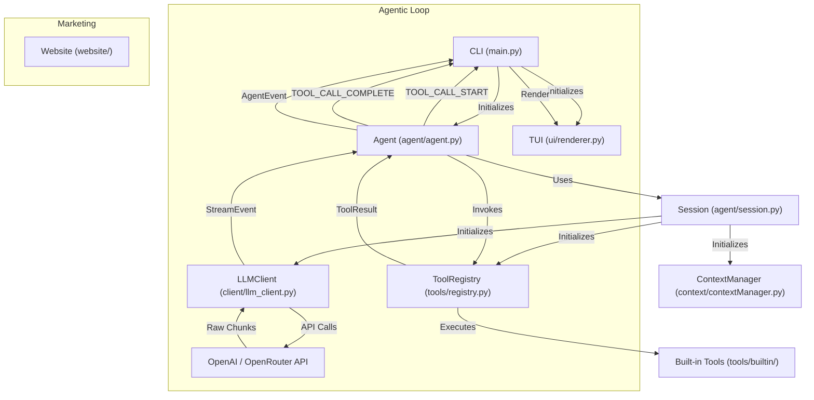

# Architecture Overview

Codentis is built on a clean, event-driven, multi-layered architecture designed for extensibility and robustness. The core principle is separation of concerns between the user interface, the agentic logic, tool execution, and low-level LLM communication.


```mermaid
graph TD
    CLI["CLI (main.py)"] -->|Initializes| Agent["Agent (agent/agent.py)"]
    CLI -->|Initializes| TUI["TUI (ui/renderer.py)"]
    Agent -->|Uses| Session["Session (agent/session.py)"]
    Session -->|Initializes| LLMClient["LLMClient (client/llm_client.py)"]
    Session -->|Initializes| ContextManager["ContextManager (context/contextManager.py)"]
    Session -->|Initializes| ToolRegistry["ToolRegistry (tools/registry.py)"]
    LLMClient -->|API Calls| OpenAI["OpenAI / OpenRouter API"]
    ToolRegistry -->|Executes| Tools["Built-in Tools (tools/builtin/)"]

    subgraph Agentic Loop
        OpenAI -->|Raw Chunks| LLMClient
        LLMClient -->|StreamEvent| Agent
        Agent -->|TOOL_CALL_START| CLI
        Agent -->|Invokes| ToolRegistry
        ToolRegistry -->|ToolResult| Agent
        Agent -->|TOOL_CALL_COMPLETE| CLI
        Agent -->|AgentEvent| CLI
        CLI -->|Render| TUI
    end

    subgraph Marketing
        Website["Website (website/)"]
    end
```

## Core Components

### 1. Client Layer (`client/`)
Handles all external communication with Large Language Models.

- **`LLMClient`** (`llm_client.py`): A wrapper around the `AsyncOpenAI` client. Handles:
  - Authentication via `.env`.
  - Rate limiting with automatic retries and exponential backoff.
  - Response streaming — yields typed `StreamEvent` objects.
  - Tool call accumulation from streamed chunks.
- **`response.py`**: Defines data structures for LLM responses:
  - `StreamEvent` / `StreamEventType` — raw chunk types: `TEXT_DELTA`, `TOOL_CALL_COMPLETE`, `MESSAGE_COMPLETE`, `ERROR`.
  - `TokenUsage` — token consumption stats.
  - `ToolCall` — a completed tool call parsed from a streamed response.
  - `ToolResultMessage` — wraps tool output for re-injection into context.

---

### 2. Agent Layer (`agent/`)
Contains the core agentic loop and event orchestration.

- **`Agent`** (`agent.py`): The high-level orchestrator for the agentic loop.
  - Manages a **`Session`** object.
  - `run()` — top-level entry point; emits `AGENT_START` → loop events → `AGENT_END`.
  - `agentic_loop()` — implements the multi-turn logic: streams LLM response, accumulates tool calls, invokes tools via the session, and feeds results back into context until completion or max turns.
- **`Session`** (`session.py`): Encapsulates the state for a single conversation thread.
  - Holds instances of `LLMClient`, `ContextManager`, and `ToolRegistry`.
  - Manages `session_id`, `created_at`, `updated_at`, and `turn_count`.
- **`events.py`**: Defines high-level agent events emitted to the CLI:

| Event | Payload |
|---|---|
| `AGENT_START` | `message` |
| `AGENT_END` | `response`, `usage` |
| `AGENT_ERROR` | `error`, `details` |
| `TEXT_DELTA` | `content` (streaming chunk) |
| `TEXT_COMPLETE` | `content` (full text) |
| `TOOL_CALL_START` | `call_id`, `name`, `arguments` |
| `TOOL_CALL_COMPLETE` | `call_id`, `name`, `success`, `output`, `error`, `metadata`, `truncated` |

---

### 3. Tool System (`tools/`)
A pluggable tool execution layer with validation, kind-based categorisation, and schema export.

- **`base.py`**: Core abstractions:
  - `ToolKind` — enum: `READ`, `WRITE`, `SHELL`, `NETWORK`, `MEMORY`, `MCP`.
  - `ToolInvocation` — carries `params` and `cwd` for an execution request.
  - `ToolResult` — carries `success`, `output`, `error`, `metadata`, `truncated`. Has factory methods `success_result()` and `error_result()`, plus `to_model_output()` for serialisation back to the LLM.
  - `ToolConfirmation` — used for mutating tools that may require user approval.
  - `Tool` (abstract base) — all tools inherit from this. Provides `validate_params()`, `is_mutating()`, `get_confirmation()`, and `to_openai_schema()`.

- **`registry.py`**: `ToolRegistry` — a runtime registry of `Tool` instances.
  - `register()` / `unregister()` — dynamic tool management.
  - `get_schemas()` — exports all tool schemas in OpenAI function-calling format.
  - `invoke()` — validates params, runs `tool.execute()`, handles exceptions, returns `ToolResult`.
  - `create_default_registry()` — factory that auto-registers all built-in tools.

- **`builtin/`**: Built-in tool implementations.
  - **`read_file.py`** (`ReadFileTool`): Reads text files with line numbers, optional offset/limit pagination, token-budget truncation, and binary-file detection.
  - **`write_file.py`** (`WriteFileTool`): Writes full content to files, supporting directory creation.
  - **`edit_file.py`** (`EditFileTool`): Performs precise search-and-replace line edits within existing files.
  - **`apply_patch.py`** (`ApplyPatchTool`): Similar to `EditFileTool` but supports multiple non-contiguous edits in a single call.
  - **`shell.py`** (`ShellTool`): Executes shell commands, capturing STDOUT/STDERR separately and supporting timeout limits.

---

### 4. Context Layer (`context/`)
Manages the conversation history passed to the LLM.

- **`ContextManager`** (`contextManager.py`):
  - Maintains an ordered list of `MessageItem` objects.
  - Prepends the system prompt on every call to `get_messages()`.
  - Tracks token counts per message (user, assistant, and tool messages).
  - `add_assistant_message(content, tool_calls=None)` — accepts the serialized tool call list so the LLM receives proper function-call history.
  - `add_tool_result()` — explicitly tracks and preserves `tool_call_id` to prevent provider matching errors.
  - Methods: `add_user_message()`, `add_assistant_message()`, `add_tool_result()`, `get_messages()`.
- **`MessageItem`**: Dataclass representing a single conversation turn. Serialises to OpenAI message dict format, supporting `role`, `content`, `tool_call_id`, and `tool_calls`.

---

### 5. UI Layer (`ui/`)
Terminal rendering using `rich`.

- **`TUI`** (`renderer.py`): Handles all terminal output.
  - `print_welcome(title, lines)` — renders a styled welcome panel at startup showing model, cwd, and available commands.
  - `begin_assistant()` / `end_assistant()` — framed streaming output.
  - `stream_assistant_delta()` — live text streaming.
  - `tool_call_start()` — renders a running panel with tool name, call ID, and arguments.
  - `tool_call_complete()` — renders a success/failure panel. For `read_file`, parses the line-numbered output and renders it as a `Syntax`-highlighted code block (theme: `monokai`) with a relative-path header.
  - `guess_language()` — maps file extensions to `rich`/Pygments language identifiers.
  - `extract_read_file_code()` — parses `read_file` output into `(start_line, code)` for syntax display.
- **Theme**: Custom `AGENT_THEME` with roles for `info`, `warning`, `error`, `tool.*`, `code`, etc.

---

### 6. Config Layer (`config/`)
- **`Config`** (`config.py`) & **`loader.py`**: Loads runtime configuration from TOML files.
  - Implements a hierarchical configuration strategy, merging system-wide settings with project-specific settings (from `.agent/codentis.toml`, which is kept untracked by Git).
  - `model_name` — read from the `[model]` block.
  - `cwd` — current working directory.
  - `developer_instructions` — can be automatically loaded from `.agent/agent.md`.
  - Instantiated by loader and shared by `Agent` and `ContextManager` across all layers.

---

### 7. Utilities (`utils/`)
- **`paths.py`**: `resolve_path()` (resolves relative paths against a base), `is_binary_file()`, `display_path_relative_to_cwd()`.
- **`text.py`**: Token counting (`count_tokens`, `estimate_tokens`) and text truncation (`truncate_text`, `truncate_by_lines`, `truncate_by_characters`).

---

### 8. Website Layer (`website/`)
A Next.js-based presentation layer for Codentis.

- **Next.js App Router**: Located in `website/app/`.
- **Components**: Reusable UI elements in `website/app/components/` (Hero, Features, Architecture diagram, etc.).
- **Styling**: Global CSS and Tailwind-like utility styles in `website/app/globals.css`.

---

## Tool Lifecycle

```
Agent.agentic_loop()
  │
  ├─ LLM streams TOOL_CALL_COMPLETE events
  │    └─ Tool calls accumulated in list
  │
  ├─ For each tool_call:
  │    ├─ emit TOOL_CALL_START  →  TUI renders "running..." panel
  │    ├─ ToolRegistry.invoke()
  │    │    ├─ validate_params()
  │    │    └─ tool.execute(ToolInvocation)  →  ToolResult
  │    └─ emit TOOL_CALL_COMPLETE  →  TUI renders result panel
  │
  └─ All ToolResults added back to ContextManager as "tool" role messages
```

---

## CLI Modes

### Single-shot mode
```
python main.py "<prompt>"
```
Runs one message through the agent and exits.

### Interactive mode
```
python main.py
```
Launches a persistent REPL loop:
- Prints a welcome panel (model, cwd, available commands) at startup.
- Reads input via `asyncio.to_thread` (non-blocking, safely cancellable).
- **Ctrl+C** (during input or agent processing) prints an interrupt message and continues — never exits.
- Supported commands: `/exit`, `/quit` (clean exit), `/help`, `/config`, `/model`, `/approval`.
- `EOFError` (Ctrl+D) exits cleanly.

---

## Event Flow Summary

```
User Input
  → CLI.run_single()  OR  CLI.run_interactive()
    → Agent.run()
      → ContextManager.add_user_message()
      → Agent.agentic_loop()
        → LLMClient.chat_completion()  [streaming]
          → TEXT_DELTA events  →  TUI.stream_assistant_delta()
          → TOOL_CALL_COMPLETE events  →  accumulated
        → ContextManager.add_assistant_message(text, tool_calls=[...])
        → For each tool call:
          → TOOL_CALL_START  →  TUI.tool_call_start()
          → ToolRegistry.invoke()  →  ToolResult
          → TOOL_CALL_COMPLETE  →  TUI.tool_call_complete()
          → ContextManager.add_tool_result()
      → AGENT_END
```

---

## Future Extensions

- **Multi-turn agentic loop**: Now robustly supported in `agentic_loop()`.
- **Interactive commands**: Implementation of `/help`, `/config`, etc.
- **Built-in tools**: Continued expansion (e.g. `search_file`, web search).
- **Tool confirmation**: `ToolConfirmation` infrastructure exists for prompting the user before mutating operations.
- **Memory**: A `Memory` component can be injected into `ContextManager` for long-term context.
- **MCP tools**: Future integration with Model Context Protocol.
- **Multi-Agent**: Orchestration of multiple specialist agents.
